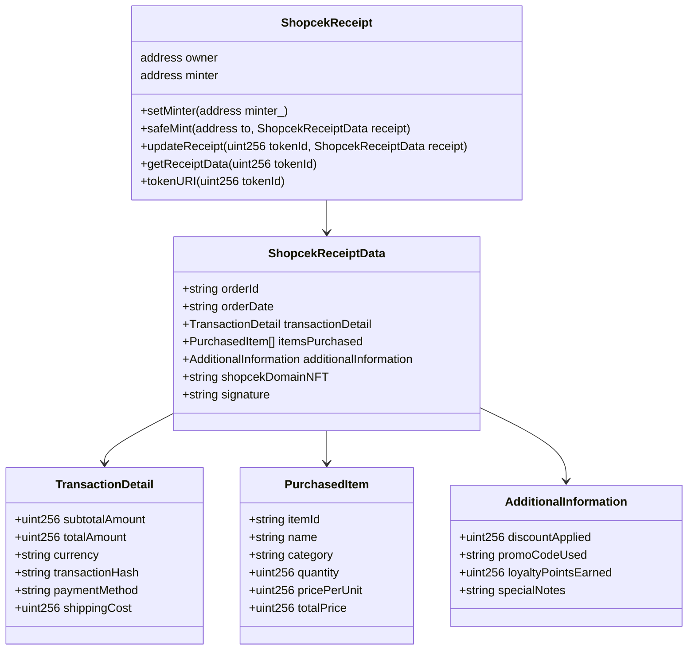

```mermaid
classDiagram
    class ShopcekReceipt {
        address owner
        address minter
        +setMinter(address minter_)
        +safeMint(address to, ShopcekReceiptData receipt)
        +updateReceipt(uint256 tokenId, ShopcekReceiptData receipt)
        +getReceiptData(uint256 tokenId)
        +tokenURI(uint256 tokenId)
    }

    class ShopcekReceiptData {
        +string orderId
        +string orderDate
        +TransactionDetail transactionDetail
        +PurchasedItem[] itemsPurchased
        +AdditionalInformation additionalInformation
        +string shopcekDomainNFT
        +string signature
    }

    class TransactionDetail {
        +uint256 subtotalAmount
        +uint256 totalAmount
        +string currency
        +string transactionHash
        +string paymentMethod
        +uint256 shippingCost
    }

    class PurchasedItem {
        +string itemId
        +string name
        +string category
        +uint256 quantity
        +uint256 pricePerUnit
        +uint256 totalPrice
    }

    class AdditionalInformation {
        +uint256 discountApplied
        +string promoCodeUsed
        +uint256 loyaltyPointsEarned
        +string specialNotes
    }

    ShopcekReceipt --> ShopcekReceiptData
    ShopcekReceiptData --> TransactionDetail
    ShopcekReceiptData --> PurchasedItem
    ShopcekReceiptData --> AdditionalInformation
```
